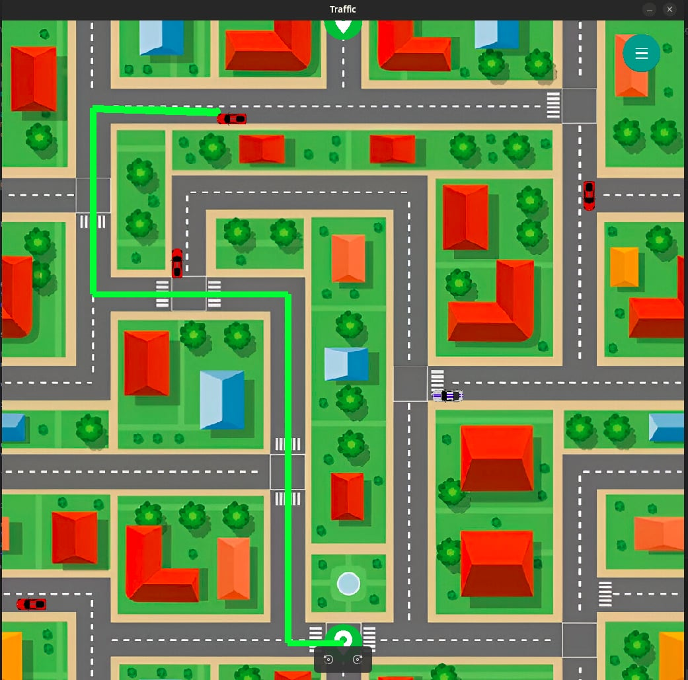

# Traffic Simulation Project

## Overview

This project is a **Traffic Simulation** application that models and visualizes traffic movement in a city-like environment. It utilizes a graph-based representation of roads and intersections, allowing vehicles to navigate efficiently.

## Features

- Visual representation of city roads and traffic.
- Graph-based road network with intersections.
- Simulation of vehicle movement.
- Customizable settings and parameters.

## Installation

### Prerequisites

Ensure you have **Python 3.x** installed. You may also need the following dependencies:

```bash
pip install pygame networkx matplotlib
```

### Running the Simulation

Navigate to the project directory and run:

```bash
python traffic/app.py
```

## Project Structure

```
TrafficSim-master/
│── traffic/
│   │── app.py             # Main application script
│   │── city_graph.py      # Graph representation of city roads
│   │── vehicle_class.py   # Vehicle movement logic
│   │── utility_func.py    # Utility functions
│   ├── src/
│   │   ├── fonts/
│   │   ├── images/
│   │   │   ├── city.jpg
│   │   │   ├── city_graph.jpeg
│   │   │   ├── location_icon.png
│   │── menu_bar.png
│── .gitignore
```

## Screenshots

### City Traffic Visualization


### Graph Representation



### Node Mapping


## License

This project is open-source. Feel free to modify and distribute it under applicable licenses.

## Author

Your Name (Modify as needed)
