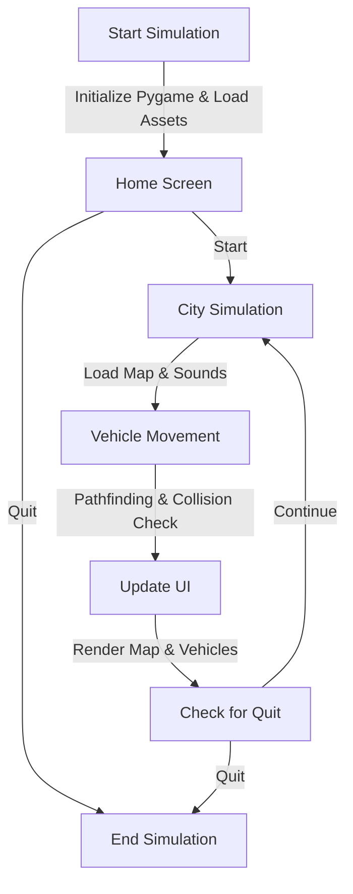

# Traffic Simulation


A Python-based traffic simulation built using **Pygame**, featuring dynamic pathfinding with Dijkstra's algorithm, vehicle collision detection, and a user-friendly interface to spawn custom vehicles. This project simulates traffic flow in a virtual city grid, accounting for congestion and real-time vehicle interactions.

---

## Table of Contents

- [Features](#features)
- [Demo](#demo)
- [Installation](#installation)
- [Usage](#usage)
- [Dependencies](#dependencies)
- [Project Structure](#project-structure)
- [Contributing](#contributing)
- [Acknowledgements](#acknowledgements)

---

## Features

- **Dynamic Pathfinding**: Utilizes a custom Dijkstra's algorithm with congestion-aware weights to find the shortest path between nodes.
- **Vehicle Behavior**: Vehicles navigate the city grid with collision avoidance and pushback mechanics.
- **Interactive UI**: Users can spawn vehicles by selecting source and destination points via a menu bar.
- **Real-Time Traffic**: Random vehicle spawning with adjustable intervals and visual path indicators.
- **Audio Effects**: Ambient city sounds and interaction sound effects enhance the experience.
- **Customizable**: Supports different vehicle types (e.g., cars, trucks) with unique visuals.

---

## Demo

  
*Caption: A demonstration of vehicles navigating the city grid with path visualization.*
---

## Installation

To set up and run the simulation locally, follow these steps:

1. **Prerequisites**: Ensure you have Python 3.8 or higher installed on your system.

2. **Clone the Repository**:
   ```bash
   git clone https://github.com/your-username/traffic-simulation.git
   cd traffic-simulation
3. **Install Dependencies**:
   ```bash
   pip install -r requirements.txt

4. **Run the Simulation**:
   ```bash
    python main.py
## Usage

Once the simulation is running, you’ll be greeted with a home screen. Here’s how to interact with Traffic Simulation:

1. **Home Screen Navigation**  
   - Click **Start** to enter the simulation.
   - Click **Quit** to exit the program.

2. **Simulation Interface**  
   - **Menu Bar**: Located at the top-right corner. Click to toggle the source/destination selection mode.
   - **Vehicle Spawning**: 
     - Random vehicles spawn automatically every 4 seconds.
     - To spawn a custom vehicle, activate the menu bar, then click two points on the map to set the source and destination.
   - **Path Visualization**: Click a vehicle to toggle its path display.

3. **Controls**  
   - **Mouse Click**: Interact with the menu or vehicles.
   - **Quit**: Close the window or press the quit button to exit.

The simulation dynamically adjusts vehicle paths based on traffic congestion, visualized through a city map with moving cars, trucks, and race cars.


## Dependencies

To run Traffic Simulation, ensure the following dependencies are installed on your system:

- **Python 3.8+**: The core programming language used for the project. Download it from [python.org](https://www.python.org/downloads/).
- **Pygame**: A Python library for game development, used for rendering the simulation and handling user input. Install it via pip:
  ```bash
  pip install pygame
    D -->|Stop Sounds & Exit| H[End];

# Traffic Simulation Project Structure

- **📁 traffic-simulation/**
  - **📁 traffic/**
    - **📁 src/**
      - **📁 fonts/**
        - `small_pixel.ttf`
      - **📁 images/**
        - `city.jpg`
        - `truck.png`
        - `redcar.png`
        - `race_car.png`
        - `location_icon.png`
        - `menu_bar.png`
      - **📁 sound/**
        - `city_sound.mp3`
        - `select_sound.mp3`
        - `intro_sound.mp3`
    - `city_graph.py`
    - `consts.py`
    - `main.py`
    - `sound.py`
    - `ui_class.py`
    - `utility_func.py`
    - `vehicle_class.py`
  - `README.md`
 
# Contributing to Traffic Simulation

We welcome contributions to enhance **Traffic Simulation**! Whether you’re fixing bugs, adding features, or improving documentation, your input is valuable. Please follow these 7 steps to contribute:

1. **Fork the Repository**  
   Click the **Fork** button at the top-right of this page to create your own copy of the repository.

2. **Clone Your Fork**  
   Download your fork to your local machine:
   ```bash
   git clone https://github.com/your-username/traffic-simulation.git
   cd traffic-simulation
3. **Create a Branch**  
    ```bash
   git checkout -b feature/your-feature-name
4. **Commit Your Changes**  
   Commit your updates with a clear message:
   ```bash
   git add .
   git commit -m "Add feature: describe your changes here"
4. **Push to Your Fork**  
    Upload your branch to GitHub:
    ```bash
   git push origin feature/your-feature-name
## Acknowledgments

Traffic Simulation wouldn’t be possible without the following contributions and resources:

- **Pygame**: A heartfelt thank you to the [Pygame](https://www.pygame.org/) community for providing a robust and versatile library that powers the simulation’s graphics, input handling, and audio features.
- **Inspiration**: This project draws inspiration from real-world traffic simulation systems and graph theory applications, blending theoretical concepts with interactive visualization.
- **Open-Source Community**: Gratitude to the broader open-source ecosystem for tools like Python and Git, which enable collaborative development and deployment.


This project reflects a passion for simulating complex systems and is made better by the support of these foundational elements. If you’ve contributed in any way, your efforts are deeply appreciated!


 

